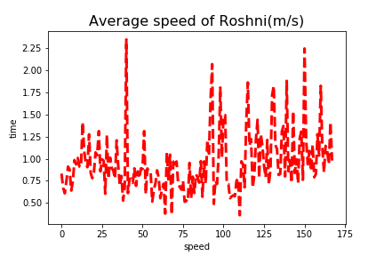

# fitness-data-analysis
Analysis of Google Fit data using Python

This project takes fitness data from Google Takeout - Google Fit, cleans it, processes it and analyses it to visualise the various indicators in measuring/monitoring an individuals fitness.an

Below is a depiction of average walking speed (in m/s), over a period of 2 years.

